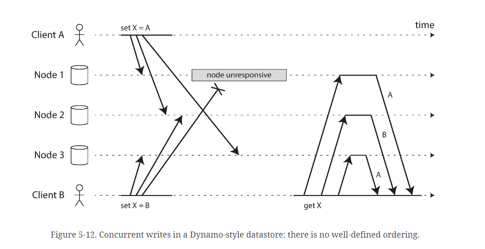
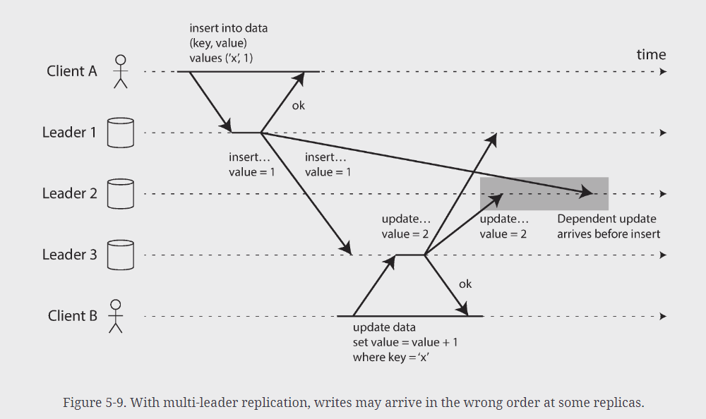

# Designing Data-Intensive Applications

- Note: This is a book by Martin Kleppmanm

## Reliable, Scalable, and Maintainable Applications

## Chapter 5: Replication

### Leaderless Replication

#### Detecting Concurrent Writes

- Dynamo-style databases allow several clients to concurrently write to the same key, which 
  means that conflicts will occur even if strict quorums are used
- Events may arrive in different order at different nodes due to variable network delays and 
  partial failures
- Example
  - Two clients A and B simultaneously writing to a key `X` in a 3 node datastore
    - Node 1 receives the write from A, but never receives the write from B due to a transient 
      outage
    - Node 2 first receives the write from A, then the write from B
    - Node 3 receives the write from B, then the write from A
    - If each node overwrote the value for the key whenever it received a write from a client, 
      the nodes would be permanently inconsistent
    - Replicas should converge toward the same value

#### Last write wins (discarding concurrent writes)

- Cassandra uses this
  - Only one supported
- Each replica only stores the most "recent" value and allows "older" values to be overwritten 
  and discarded
  - Need some way of unambiguously determining which write is most "recent"
- Most "recent" can be unclear
- In our previous example, it is not clear which one happened first because neither client knew 
  about the other one when it sent its write requests to the database nodes
  - In this case the saw the writes are `concurrent`
- Even though the writes don't have a natural ordering, we can force an arbitrary order on them
  - Attach a timestamp to each write, pick the biggest timestamp as the most "recent" and 
    discard any writes with an earlier timestamp

 

- LWW achieves goal of eventual convergence but at the cost of durability
  - If there are several writes to the same key, even if they are all reported as successful to 
    the client (because they are written to `w` replicas) only one of the writes will survive 
    and the others will be silently discarded
  - If losing data is not acceptable, LWW is a poor choice for conflict resolution
- Only safe way of using a database with LWW is to ensure that a key is only written once and 
  thereafter treated as immutable
  - A recommended way of using Cassandra is to use a UUID as a key, thus giving each write 
    operation a unique key
    - https://www.datastax.com/blog/why-cassandra-doesnt-need-vector-clocks

#### The "happens-before" relationship and concurrency

- How to decide whether two operations are concurrent or not
- In below image, the two writes are not current: A's insert *happens before* B's increment
  - B's operation builds upon A's operation - *causally dependent*

- In below image, two writes are concurrent: when each client starts the operation, it does not 
  know that another client is performing an operation on the same key

 

- We can say that two operations are *concurrent* if neither happens before the other (neither 
  knows about the other)
- Whenever you have two operations A and B, there are 3 possibilities
  - A happened before B
  - B happened before A
  - A and B are concurrent
- Need an algorithm to tell us whether two operations are concurrent or not
- If one operation happened before another, the later operation should overwrite the earlier 
  operation, but if the operations are concurrent, we have a conflict that needs to be resolved

------------
**Concurrency, Time, and Relativity**

- It may seem that 2 operations should be called concurrent if they occur "at the same time" but 
  it is not important whether they literally overlap in the
- Because of the problem w/ clocks in distributed systems, it is difficult to tell whether 2 
  things actually happened at the same time
- We call two operations *concurrent* if they are both unaware of each other, regardless of the 
  physical time at which they occur
  - If network was slow or interrupted at the time, 2 operations can occur at different times 
    and still be concurrent b/c the network problems prevented one operation from being able to 
    know about the other

------------